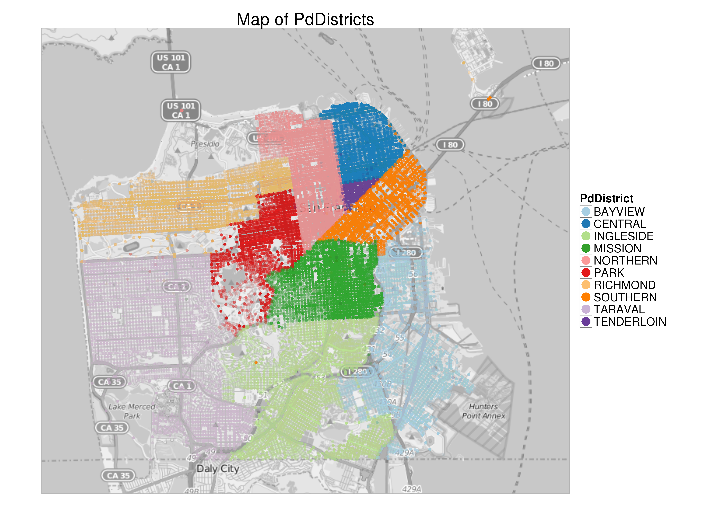

```{r setup, include=FALSE}
knitr::opts_chunk$set(echo = TRUE)
```
#Introducci칩n
Se ha elegido para este trabajo la competici칩n de Kaggle de la evoluci칩n del crimen en San Fracisco, se puede acceder en el siguiente link: <https://www.kaggle.com/c/sf-crime>. Es una opci칩n interesante ya que podemos ver y hacer gr치ficos sobre el mapa de San Franciso directamente como se ver치 a continuaci칩n.

Primero cargamos las librer칤as necesarias:
```{r, message=FALSE}
library(plyr)
library(dplyr)
library(ggmap)
library(ggplot2)
library(readr)
library(lubridate)
library(caret)
library(knitr)
library(stringr)
```
Tenemos opci칩n de usar librer眼 **doMC** para poder hacer multiprocesamiento cuando entrenemos los modelos:
```{r, eval=FALSE}
library(doMC)
registerDoMC(cores = 4)
```

Cargamos los datos:
```{r}
train <- read_csv("./input/train.csv.zip")
#test <- read_csv("./input/train.csv.zip")

```

En la p치gina de Kaggle nos dice que las variables **Resolution** y **Descript** solo existen en el conjunto de entreno proporcionado. Optamos por suprimirlas tambi칠n en nuestro conjunto de entreno.
```{r}
train$Resolution <- NULL
train$Descript <- NULL
```
\newpage
Damos un primer vistazo a los datos de entreno, comprobando as칤 que se han cargado satisfactoriamente y vemos que pinta tiene:
```{r}
options(dplyr.width = Inf)
kable(head(train))
summary(train)
```

Vemos tambi칠n que tipo de delitos manejaremos y cuantos hay de cada uno:
```{r}
sort(table(train$Category), decreasing = TRUE)
```

Es conveniente que separemos las fecha en horas, d칤as, mes y a침o, ya que aunque se creen nuevas variables, es una mejor forma de tratarlo y podemos pensar que ciertos delitos pueden darse m치s en unas horas que otras. Por ejemplo, sguramente es m치s probable un robo de noche que de d칤a.

```{r}
train <- mutate(train,
                Year = factor(year(Dates), levels = 2003:2015), 
                Month = factor(month(Dates), levels = 1:12), 
                Day = factor(day(Dates), levels = 1:31),
                Hour = factor(hour(Dates), levels = 0:23),
                DayOfWeek = factor(DayOfWeek, levels=c("Monday",
                                                  "Tuesday",
                                                  "Wednesday",
                                                  "Thursday",
                                                  "Friday",
                                                  "Saturday",
                                                  "Sunday"))
                )
train$Dates <- NULL

# test <- mutate(test,
#                 Year = factor(year(Dates), levels = 2003:2015), 
#                 Month = factor(month(Dates), levels = 1:12), 
#                 Day = factor(day(Dates), levels = 1:31),
#                 Hour = factor(hour(Dates), levels = 0:23),
#                 DayOfWeek = factor(DayOfWeek, levels=c("Monday",
#                                                   "Tuesday",
#                                                   "Wednesday",
#                                                   "Thursday",
#                                                   "Friday",
#                                                   "Saturday",
#                                                   "Sunday"))
#                 )
# test$Dates <- NULL

```


Acortamos los nombres de las calles, as칤 solo nos quedamos con el nombre de la calle, no el n칰mero de bloque, casa, etc...:
```{r, eval=FALSE}
train$ShortAddr <- word(train$Address, start=-2, end=-1)
#test$ShortAddr <- word(test$Address, start=-2, end=-1)
#train$Address <- NULL

```
\newpage
```{r}
kable(head(train[,-6:-1]))
```

\newpage
#Visualizaci칩n


Vemos los histogramas de las distintas variables para ver si encontramos alguna interesante. Podemos pensar que por ejemplo el barrio influye mucho, as칤 como el d칤a de la semana o la hora que sea.
```{r, fig.pos = 'p', fig.show='hold', out.width='50%'}
ggplot(train, aes(x=PdDistrict)) + geom_bar(colour='black', fill='skyblue')+ggtitle('# crimenes por distrito')
ggplot(train, aes(x=DayOfWeek)) + geom_bar(colour='black', fill='skyblue')+ggtitle('# crimenes por dia semana')
ggplot(train, aes(x=Hour)) + geom_bar(colour='black', fill='skyblue')+ggtitle('# crimenes por hora')

```

Podemos conseguir un mapa de San Franciso con la librer칤a ggmap y poder d칩nde se encuentran los distintos distritos.
```{r, fig.align='center', message=FALSE, warning=FALSE, eval=FALSE}
map<-get_map(location="sanfrancisco", zoom= 12, color = "bw")

ggmap(map) +
     geom_point(data=train[1:200000,], aes(x=X, y=Y, color=factor(PdDistrict)), alpha=0.05) +
     guides(colour = guide_legend(override.aes = list(alpha=1.0, size=6.0),
                                  title="PdDistrict")) +
     scale_colour_brewer(type="qual",palette="Paired") +
     ggtitle("Map of PdDistricts")

```


\newpage
```{r, eval=FALSE, message=FALSE, out.width='40%'}
contours <- stat_density2d(
aes(x = X, y = Y, fill = ..level.., alpha=..level..),
size = 0.1, data = train, n=200,
geom = "polygon")

ggmap(map, extent='device', legend="topleft") + contours +
scale_alpha_continuous(range=c(0.25,0.4), guide='none') +
scale_fill_gradient('Violent\nCrime\nDensity')+
ggtitle('Violent Crime in San Francisco')
```


```{r}

dummies <- dummyVars( ~ Hour + DayOfWeek, data = train)
dummy_train <- data.frame(predict(dummies, newdata= train))
dummy_train$Category <- train$Category
dummy_train$X <- train$X
dummy_train$Y <- train$Y
train <- dummy_train
rm(dummy_train)

```

\newpage
#Construcci칩n del modelo

```{r}
train$Category <- make.names(train$Category)

train_partition <- createDataPartition(y=train$Category, p=.001, list=FALSE)
training <- train[train_partition,]

ctrl <- trainControl(method = "repeatedcv",number=10, classProbs=TRUE, summaryFunction=mnLogLoss)
formula <- Category ~ .

model_knn <- train (formula, tuneLength=10, data=training,method='kknn',trControl=ctrl, metric="logLoss", verbose = TRUE)
model_knn
plot(model_knn)

model_rf <- train (formula, tuneLength=10, data=training,method='rf',trControl=ctrl, metric="logLoss", verbose = TRUE)
model_rf
plot(model_rf)

#Con c50 falla en multiproceso
model_c50 <- train (formula, tuneLength=10, data=training,method='C5.0',trControl=ctrl, metric="logLoss", verbose = TRUE)
model_c50
plot(model_c50)

# model_nb <- train (formula, tuneLength=10, data=training,method='nb',trControl=ctrl, metric="logLoss", verbose = TRUE)
# model_nb
# plot(model_nb)

```


```{r}
results <- resamples(list(KNN=model_knn, ModelC50 = model_c50, RF=model_rf ))
summary(results)
bwplot(results)
dotplot(results)
```


